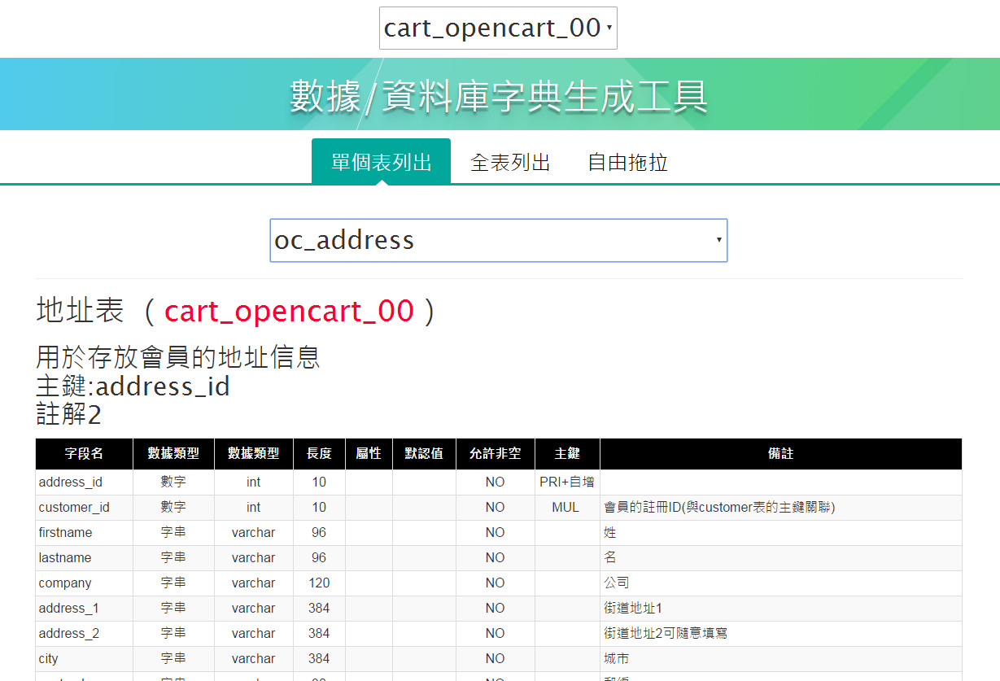

---------------------------------------
#產品名稱-繁體中文
---------------------------------------
	數據/資料庫 字典 生成/導出/產生/ 工具
	mysql數據庫字典生成工具 PHP版
---------------------------------------
#簡體中文名稱
---------------------------------------
	mysql数据词典生成器
	mysql数据字典生成工具
	mysql数据库生成数据字典工具
	mysql数据库数据字典生成导出工具
	数据表查看及字典生成工具 ...
---------------------------------------
#英文名稱
---------------------------------------
	DataDictionaryTool
	PhpDataDictionaryTool
	data base dictionary edit Tool
	php-mysql-DataDictionaryTool
---------------------------------------
#軟體介紹
---------------------------------------
	小巧好用的mysql數據庫數據字典生成導出綠色工具
	數據庫生成數據字典工具(PhpDataDictionaryTool)，支援數據庫包括mysql,等等，可以導出excel,word,html,xls,txt文件
<<<<<<< HEAD
	
	
>>>>>>> master
---------------------------------------
#使用方式
---------------------------------------
	第一步 填寫資料庫密碼，修改config.inc.mysql.php
```php
$cfg['servers'][$i]['host'] = 'localhost';          	//服務器位址
$cfg['servers'][$i]['port'] = '3306';                 	//端口
$cfg['servers'][$i]['user'] = 'root';            	//數據庫用戶名
$cfg['servers'][$i]['password'] = '1234567890'; 	//密碼
$cfg['servers'][$i]['database'] = 'opencart_00';      	//預設開啟資料庫
```
	第二步 獲取數據庫列表
	第三步 選擇導出類型，點擊導出按鈕
---------------------------------------
#工具能夠解決什麼問題
---------------------------------------
	場景一：我是新員工有沒有數據庫設計說明書啊，方便我查找和學習，每次都要查表好麻煩的說。

	場景二：工作交接，上頭要你交一份料庫詳細列表!哭暈!因為你重來就沒幫資料庫打過註解

	場景三：最近我在做移植類需求，但是找不到之前表結構創建的升級語句了，又得重新把表創建一遍了，真是麻煩

	場景四：接收一個完全沒打任何註解的資料庫，靠北，前人都沒打，有沒有打註解比較快的工具阿	

	場景五：手上有2個資料庫OPENCART v1.5.6.4 和v2.3.0.2，得整理一個表結構修改的文檔，沒工具的話要怎麼比對
		
	場景六：最近在做接口需求，需要和第三方進行交互，但是他們不瞭解我們數據結構設計，希望我們能提供一個相關文檔

	一想到要在WORD裡面創建一個一個的表格，從表裡面一個字段一個字段的複製中文英文，想想都覺得麻煩浪費時間，怎麼樣能自動生成數據字典文檔
	WORD文檔結構的數據庫設計說明書看得好揪心啊，首先表格那麼多紅色的下劃線，寬度也窄了。想換種風格，HTML格式怎麼樣，看起來的確挺小清晰的。
---------------------------------------
#主要功能:
---------------------------------------
      1.快速找查資料庫某一張表，單張列印，全部列印，
      2.導出為word,html格式的數據字典文件.      
      3.逆向獲取表結構信息,為您製作數據字典。 
      4.輔助功能，比如SQL腳本生成，excel,word,html,xls,txt文件導出等。
      5.數據字典和表結構的校對功能。
---------------------------------------
#使用本工具打資料表註解-雖然你只能打一行子，但是可以使用符號達到換行目的
---------------------------------------
	:前表示 表中文名
	:後表示 表用途 (沒有也可以)
	『#』號後都是註解，且之後『#』號表示換行 (沒有也可以)
------------------------------------------------------
	範例1
		產品分類表
	範例2
		產品分類表#主鍵：category_id
	範例2
		產品分類表：用於商品的多級分類#主鍵：category_id
	範例3
		產品分類表：用於商品的多級分類#主鍵：category_id#備註第2行#備註第3行
---------------------------------------
#關鍵字
---------------------------------------
	數據/資料庫 字典 生成/導出/產生/ 工具
---------------------------------------
#使用經驗總結
---------------------------------------
	逆向生成MySQL 數據字典
---------------------------------------
#數據字典百度百科解釋
---------------------------------------
	http://baike.baidu.com/item/%E6%95%B0%E6%8D%AE%E5%AD%97%E5%85%B8 数据字典 百度百科解釋

---------------------------------------
#同類產品比較
---------------------------------------
	DataDictionaryTool 	一款生成数据库字典工具支持mysql和oracle
	DataDic
	PDMREAD			2007.11月~2010.1013就無再更新 http://www.pdmreader.com/
	PowerDesign		2014年之後不在更新
---------------------------------------
#相關網址收集
---------------------------------------
	#台灣人開發的軟體
	https://github.com/hueitan/made-in-taiwan#php	
---------------------------------------
#版面配色參考
---------------------------------------
	#Discuz! X3 数据字典 藍白配色
	http://faq.comsenz.com/library/database/x3/x3_index.htm 
---------------------------------------
#商業模式
---------------------------------------
	1.自由捐款方式回饋給作者.
	2.贊助商
		鑽石贊助商
		白金贊助商
		黃金贊助商
---------------------------------------
#獲利分析 比照phpmyadmin 自由捐款方式
	https://www.phpmyadmin.net/sponsors/ 參考phpmyadmin
---------------------------------------
	贊助等級
		水平	年金額（美元）	標誌/鏈接
		鑽石	$ 20000	250x250標誌在主頁和讚助商頁面
		鉑	$ 10000	250x130標誌在主頁和讚助商頁面
		金	$ 7500	250x70標誌或主頁和讚助商頁面上的文本鏈接
		銀	$ 2500	250x70標誌僅在讚助商頁面上
		青銅	$ 1000	贊助商頁面上的文本鏈接
---------------------------------------
#版本列表
---------------------------------------
0.0.0.8	
	20170503	增加後台是否要密碼才能進入的設定，密碼提示:9個字全小寫無空格(B.C. & Lowy: 美國實況主在遊戲中大喊的一句話taiwan?)
---------------------------------------
#程式下載位置
---------------------------------------
https://github.com/suffixbig/PhpDataDictionaryTool
